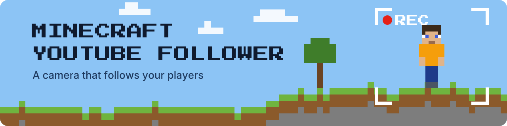

---
hide:
  - navigation
---

# Minecraft YouTube Follower { .myf-visually-hidden }

  

  
  
  
  

---

**Minecraft YouTube Follower** puts a spectator bot on your Minecraft Java server that follows the players with a third-person camera, and streams what it sees to YouTube or Twitch with the player's name on screen and Minecraft music underneath. Streaming a server by hand means a player's own client running OBS, one point of view, and a stream that ends when that player logs off. Here the camera is a separate account that nobody has to play, it moves between players on its own, and the stream stops when the server empties and starts again when someone joins. Start with [Getting started](getting-started.md), then [Mojang API approval](mojang-api-approval.md), the step that takes longest.

-   :material-docker: **[Getting started](getting-started.md)**

    ---

    What you need, the Azure app, the `.env` file, the three containers, and the one-time sign-in of the bot.

-   :material-shield-check-outline: **[Mojang API approval](mojang-api-approval.md)**

    ---

    Why a new Azure app gets "Invalid app registration", and how to ask Mojang to allow it.

-   :material-video-outline: **[Usage](usage.md)**

    ---

    What the stream shows, what the logs say, and how to update, restart and stop it.

-   :material-tune: **[Configuration](configuration.md)**

    ---

    Every environment variable and its default: camera, stream, overlay, music, performance, voice chat.

## Watch it

Two streams from a real server: the [24/7 server stream](https://youtube.com/live/7pPMtL0e8eE) and a [player following demo](https://youtube.com/live/9ns0jZ_VBC4). What is on screen, and when, is described in [Usage](usage.md#what-the-stream-shows).

## What it does

- Follows one player at a time from behind and above, facing their eyes, and moves on to the next player every 30 seconds when more than one is online.
- Shows `Now following: <name>` on the stream, and loops the music you add (see [Adding Minecraft music](configuration.md#adding-minecraft-music)).
- Streams to YouTube over RTMP or HLS, or to Twitch, at 1280x720 and 30 fps by default, with Intel VAAPI hardware encoding when an Intel GPU is passed through to the container.
- Stops sending when nobody is online, and starts again when a player joins.
- Ships a Mumble server so the players can talk while they play.

## How it runs

- Three containers from one compose file: the spectator bot (`drumsergio/minecraft-spectator-bot`), the streaming service (`drumsergio/minecraft-streaming-service`), both pinned to a release tag and built for amd64, and a Mumble server. See [How it works](how-it-works.md).
- The bot needs its own Minecraft Java Edition account, an Azure app registration that Mojang has approved, and to be whitelisted and opped on your server. The sign-in tokens stay in a Docker volume, so it signs in once.
- Running Mumble on its own on Unraid: [Mumble deployment (Unraid)](mumble.md).

## What it does not do

- It does not run the Minecraft server; it connects to yours.
- It does not stream while the server is empty.
- It does not put the Mumble voice chat on the stream; the stream carries the music only.
- It does not work until Mojang has approved your Azure app, which can take days or weeks.

## Privacy

- The stream is public on YouTube or Twitch and shows the in-game name of the player it follows. Tell your players before you turn it on.
- The bot's Microsoft sign-in tokens live in the `minecraft-bot-auth` volume on your host. Stream keys stay in your `.env` file.

## Getting help

- Something broken: read [Troubleshooting](troubleshooting.md), then open an [issue](https://github.com/GeiserX/Minecraft-Youtube-Follower/issues).
- A security problem: follow the [security policy](https://github.com/GeiserX/Minecraft-Youtube-Follower/blob/main/SECURITY.md), never a public issue.
- Changing the code, running the tests, rebuilding the images: [Development](development.md).

## License

Minecraft YouTube Follower is released under the [GPL-3.0-or-later](https://github.com/GeiserX/Minecraft-Youtube-Follower/blob/main/LICENSE) license. It is built on [Mineflayer](https://github.com/PrismarineJS/mineflayer) and [prismarine-viewer](https://github.com/PrismarineJS/prismarine-viewer).
